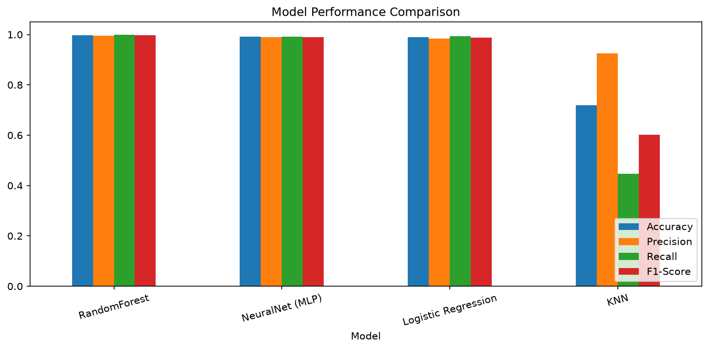
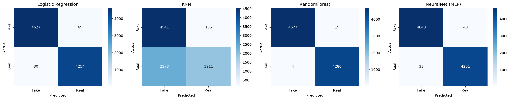
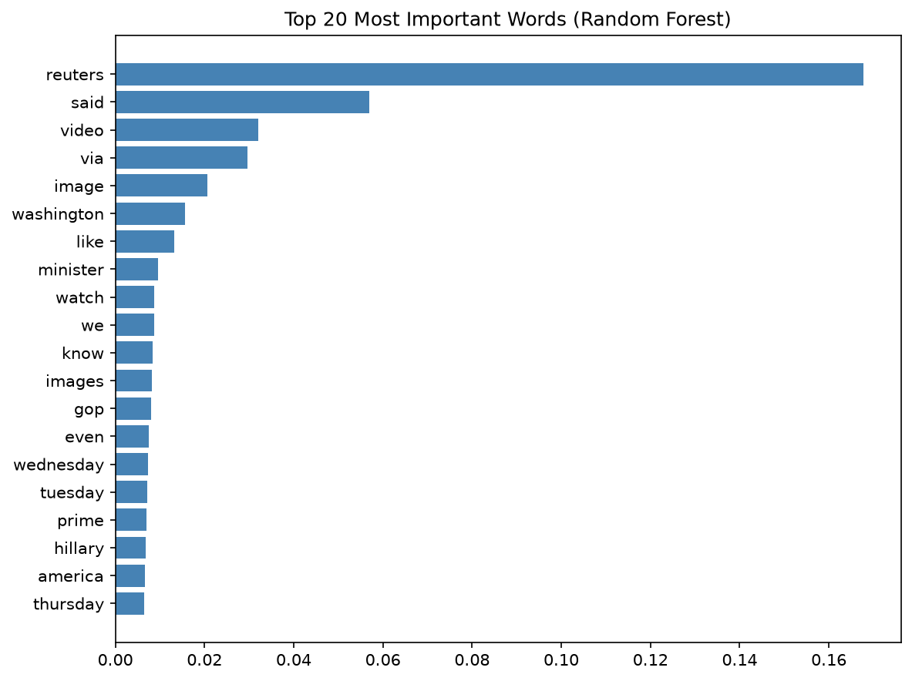

# 📰 AI-Powered Fake News Detection Using NLP & Machine Learning

> Built from scratch as part of the **AI & ML Summer Internship Program** at the **Indian Institute of Computing and Technology (IICT)**, registered with I-STEM, Office of the Principal Scientific Adviser to the Govt. of India.

A complete, from-scratch machine learning pipeline that classifies news articles as **real** or **fake** using natural language processing and four classical ML algorithms — no pre-built/AutoML solutions used.


---

## 📌 Overview

Misinformation spreads fast, and manually verifying every article doesn't scale. This project builds a text classification pipeline — from raw article text to a trained, evaluated model — to automatically flag likely fake news.

**Objective:** Build the entire pipeline manually (preprocessing, feature extraction, model training, evaluation) to understand *why* each step matters, not just call a library function that does it all invisibly.

## 📂 Dataset

| Attribute | Value |
|---|---|
| Source | [Fake and Real News Dataset](https://www.kaggle.com/datasets/clmentbisaillon/fake-and-real-news-dataset) — Kaggle |
| Total articles | 44,898 |
| Real news | 21,417 |
| Fake news | 23,481 |
| Features used | Article title + body text (combined, cleaned, TF-IDF vectorized) |
| Train / Test split | 80% / 20%, stratified |

> Dataset files (`True.csv`, `Fake.csv`) aren't included in this repo due to size — download them directly from the Kaggle link above and place them in the project root before running the notebook.

## 🔧 Methodology

**1. Preprocessing** — lowercasing, HTML/URL removal, punctuation and digit stripping, manual tokenization, NLTK stopword removal.

**2. Feature Engineering** — implemented and compared two vectorization strategies:
- **Bag-of-Words** — raw word frequency counts
- **TF-IDF** — frequency weighted by how distinctive a word is across the corpus (used as the primary feature set, 5,000-word vocabulary)

**3. Model Development** — trained four classifiers spanning parametric, non-parametric, and ensemble approaches:
- K-Nearest Neighbors (KNN)
- Logistic Regression
- Random Forest (100 trees)
- Neural Network (MLPClassifier)

**4. Evaluation** — Accuracy, Precision, Recall, F1-Score, and confusion matrices for every model.

## 📊 Results

| Model | Accuracy | Precision | Recall | F1-Score |
|---|---|---|---|---|
| **Random Forest** 🏆 | **0.9974** | 0.9956 | 0.9991 | **0.9973** |
| Neural Network (MLP) | 0.9910 | 0.9888 | 0.9923 | 0.9906 |
| Logistic Regression | 0.9890 | 0.9840 | 0.9930 | 0.9885 |
| KNN | 0.7185 | 0.9250 | 0.4461 | 0.6019 |

**Model comparison:**



**Confusion matrices:**



### Key findings

- **Random Forest performed best** across every metric, benefiting from ensemble averaging across 100 trees to generalize well on high-dimensional TF-IDF features.
- **KNN significantly underperformed** (F1: 0.60 vs. ~0.99 for the other models), driven almost entirely by poor recall on real news (2,373 real articles misclassified as fake — see confusion matrix). This reflects the **curse of dimensionality**: distance-based methods like KNN struggle in high-dimensional sparse spaces (5,000 TF-IDF features), where "nearest neighbor" becomes a less meaningful concept as dimensions grow.
- **Parametric vs. non-parametric:** Logistic Regression (parametric) matched or beat non-parametric KNN by a wide margin here, showing that a well-fit linear decision boundary can outperform instance-based learning when feature space is large and sparse.
- Feature importance analysis on Random Forest surfaced source-attribution words (e.g., wire-service phrasing) as strong predictors — a useful caveat: the model may be partly learning **writing style/source conventions**, not truthfulness itself.

**Feature importance:**



## 🗂️ Project Structure

```
fake-news-detection-nlp/
├── Fake_News_Detection.ipynb       # Full pipeline notebook
├── model_comparison_results.csv    # Final metrics table
├── images/
│   ├── fig1_class_distribution.png
│   ├── fig2_top_words.png
│   ├── fig3_confusion_matrices.png
│   ├── fig4_model_comparison.png
│   └── fig5_feature_importance.png
├── requirements.txt
├── .gitignore
└── README.md
```

## ⚙️ Tech Stack

`Python` · `pandas` · `NumPy` · `scikit-learn` · `NLTK` · `matplotlib` · `seaborn` · `Jupyter Notebook`

## 🚀 Running Locally

```bash
git clone https://github.com/cyriljaiswal/fake-news-detection-nlp.git
cd fake-news-detection-nlp
pip install -r requirements.txt
```

1. Download `True.csv` and `Fake.csv` from the [Kaggle dataset](https://www.kaggle.com/datasets/clmentbisaillon/fake-and-real-news-dataset) and place them in the project root.
2. Open `Fake_News_Detection.ipynb` in Jupyter and run all cells top to bottom.

## 🔮 Future Work

- Experiment with transformer-based embeddings (e.g., BERT) instead of TF-IDF
- Address the source-style leakage caveat with a de-biased or cross-source dataset
- Deploy the best model behind a simple Streamlit interface for live headline classification

## 👤 Author

**Cyril Jaiswal (Richie)**
B.Tech CSE, MIT ADT University, Pune
[GitHub](https://github.com/cyriljaiswal) · [LinkedIn](https://linkedin.com/in/cyriljaiswal)

*Built as part of the AI & ML Summer Internship Program at IICT (2026).*
